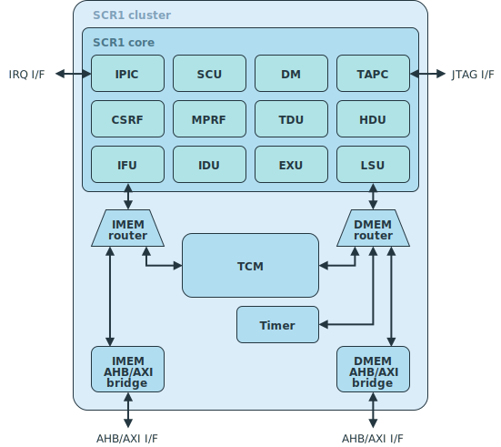

# SCR1 RISC-V Core

SCR1 is an open-source and free to use RISC-V compatible MCU-class core, designed and maintained by Syntacore. It is industry-grade and silicon-proven (including full-wafer production), works out of the box in all major EDA flows and Verilator, and comes with extensive collateral and documentation.



## Key features

* Open sourced under SHL-license (see LICENSE file) - unrestricted commercial use allowed
* RV32I or RV32E ISA base + optional RVM and RVC standard extensions
* Machine privilege mode only
* 2 to 4 stage pipeline
* Optional Integrated Programmable Interrupt Controller with 16 IRQ lines
* Optional RISC-V Debug subsystem with JTAG interface
* Optional on-chip Tightly-Coupled Memory
* 32-bit AXI4/AHB-Lite external interface
* Written in SystemVerilog
* Optimized for area and power
* 3 predefined recommended configurations
* A number of fine-tuning options for custom configuration
* Verification suite provided
* Extensive documentation

For more information on core architecture, see [SCR1 External Architecture Specification](https://github.com/syntacore/scr1/blob/master/docs/scr1_eas.pdf).

For more information on project usage, see [SCR1 User Manual](https://github.com/syntacore/scr1/blob/master/docs/scr1_um.pdf).

## Repository contents

|Folder | Description
|------ | -----------
|**dependencies**                  | **Dependent submodules**
|├─ riscv-tests                    | Common source files for RISC-V ISA tests
|├─ riscv-compliance               | Common source files for RISC-V Compliance tests
|└─ coremark                       | Common source files for EEMBC's CoreMark® benchmark
|**docs**                          | **SCR1 documentation**
|├─ scr1_eas.pdf                   | SCR1 External Architecture Specification
|└─ scr1_um.pdf                    | SCR1 User Manual
|**sim**                           | **Tests and scripts for simulation**
|├─ tests/common                   | Common source files for tests
|├─ tests/riscv_isa                | RISC-V ISA tests platform specific source files
|├─ tests/riscv_compliance         | RISC-V Compliance platform specific source files
|├─ tests/benchmarks/dhrystone21   | Dhrystone 2.1 benchmark source files
|├─ tests/benchmarks/coremark      | EEMBC's CoreMark® benchmark platform specific source files
|├─ tests/isr_sample               | Sample program "Interrupt Service Routine"
|├─ tests/hello                    | Sample program "Hello"
|└─ verilator_wrap                 | Wrappers for Verilator simulation
|**src**                           | **SCR1 RTL source and testbench files**
|├─ includes                       | Header files
|├─ core                           | Core top source files
|├─ top                            | Cluster source files
|└─ tb                             | Testbench files

## SCR1 source file lists

SCR1 source file lists of SCR1 can be found in [./src](https://github.com/syntacore/scr1/tree/master/src):

* **core.files**    - all synthesized file sources of the SCR1 core
* **ahb_top.files** - synthesized file sources of AHB cluster
* **axi_top.files** - synthesized file sources of AXI cluster
* **ahb_tb.files**  - testbench file sources for AHB cluster (for simulation only)
* **axi_tb.files**  - testbench file sources for AXI cluster (for simulation only)

Library with header files to include is [./src/includes/](https://github.com/syntacore/scr1/tree/master/src/includes)

## Simulation quick start guide

The project contains testbenches, test sources and scripts to quickly start the SCR1 simulation. Before starting the simulation, make sure you have:

* installed RISC-V GCC toolchain,
* installed one of the supported simulators,
* initialized submodules with test sources.

### Requirements

#### Operating system

GCC toolchain and make-scripts are supported by most popular Linux-like operating systems.

To run from Windows you can use an additional compatibility layer, such as WSL or Cygwin.

#### RISC-V GCC toolchain

RISC-V GCC toolchain is required to compile the software. You can use pre-built binaries or build the toolchain from scratch.

##### Using pre-built binary tools

Pre-built RISC-V GCC toolchain with support for all SCR1 architectural configurations is available for download from http://syntacore.com/page/products/sw-tools.

1. Download the archive for your platform.
2. Extract the archive to preferred directory `<GCC_INSTALL_PATH>`.
3. Add the `<GCC_INSTALL_PATH>/bin` folder to the $PATH environment variable:
```
    export PATH=<GCC_INSTALL_PATH>/bin:$PATH
```

##### Building tools from source

You can build the RISC-V GCC toolchain from sources, stored in official repo https://github.com/riscv/riscv-gnu-toolchain

Instructions on how to prepare and build the toolchain can be found on https://github.com/riscv/riscv-gnu-toolchain/blob/master/README.md

We recommend using the multilib compiler. Please note that RV32IC, RV32E, RV32EM, RV32EMC, RV32EC architectural configurations are not included in the compiler by default. If you plan to use them, you will need to include the appropriate libraries by yourself before building.

After the building, be sure to add the `<GCC_INSTALL_PATH>/bin` folder to the $PATH environment variable


#### HDL simulators

Currently supported simulators:

* Verilator (last verified version: v4.102)
* Intel ModelSim (last verified version: INTEL FPGA STARTER EDITION vsim 2020.1_3)
* Mentor Graphics ModelSim (last verified version: Modelsim PE Student Edition 10.4a)
* Synopsys VCS (last verified version: vcs-mx_vL-2016.06)
* Cadence NCSim

Please note that RTL simulator executables should be in your $PATH variable.

#### Tests preparation

The simulation package includes the following tests:

* **hello** - "Hello" sample program
* **isr_sample** - "Interrupt Service Routine" sample program
* **riscv_isa** - RISC-V ISA tests (submodule)
* **riscv_compliance** - RISC-V Compliance tests (submodule)
* **dhrystone21** - Dhrystone 2.1 benchmark
* **coremark** - EEMBC's CoreMark® benchmark (submodule)

After the main SCR1 repository has been cloned execute the following command:
```
    git submodule update --init --recursive
```

This command will initialized submodules with test sources.

### Running simulation

To build RTL, compile and run tests from the repo root folder you have to call Makefile.
By default, you may simply call Makefile without any parameters:
``` sh
    make
```

In this case simulation will run on Verilator with following parameters: `CFG=MAX BUS=AHB TRACE=0 TARGETS="hello isr_sample riscv_isa riscv_compliance dhrystone21 coremark"`.

Makefile supports:

* choice of simulator - `run_<SIMULATOR> = <run_vcs, run_modelsim, run_ncsim, run_verilator, run_verilator_wf>`
* selection of external interface - `BUS = <AHB, AXI>`,
* configuration setup - `CFG = <MAX, BASE, MIN, CUSTOM>`,
* parameters for CUSTOM configuration - `ARCH = <IMC, IC, IM, I, EMC, EM, EC, E>, VECT_IRQ = <0, 1>, IPIC = <0, 1>, TCM = <0, 1>`
* tests subset to run - `TARGETS = <hello, isr_sample, riscv_isa, riscv_compliance, dhrystone21, coremark>`
* enabling tracelog - `TRACE = <0, 1>`
* and any additional options to pass to the simulator - `SIM_BUILD_OPTS`.

Examples:
``` sh
    make run_verilator_wf CFG=MAX BUS=AXI TARGETS="riscv_isa riscv_compliance" TRACE=1
    make run_vcs CFG=BASE BUS=AHB TARGETS="dhrystone21 coremark" SIM_BUILD_OPTS="-gui"
    make run_modelsim CFG=CUSTOM BUS=AXI ARCH=I VECT_IRQ=1 IPIC=1 TCM=0 TARGETS=isr_sample
```

Build and run parameters can be configured in the `./Makefile`.

After all the tests have finished, the results can be found in `build/<SIM_CFG>/test_results.txt`.

**IMPORTANT:** To ensure correct rebuild, please clean build directory between simulation runs:
``` sh
    make clean
```

Please refer to the *"Simulation environment"* chapter of the [SCR1 User Manual](https://github.com/syntacore/scr1/blob/master/docs/scr1_um.pdf) for more information on setting up a simulation run.

## SCR1 SDKs

FPGA-based SDKs are available at the <https://github.com/syntacore/scr1-sdk>.

Repo contains:

* Pre-build images and open designs for several standard FPGAs boards:
  * Digilent Arty (Xilinx)
  * Digilent Nexys 4 DDR (Xilinx)
  * Arria V GX Starter (Intel)
  * Terasic DE10-Lite (Intel)
* Software package:
  * Bootloader
  * Zephyr RTOS
  * Tests\SW samples
* User Guides for SDKs and tools

## Contacts

Report an issue: <https://github.com/syntacore/scr1/issues>

Ask a question: scr1@syntacore.com
